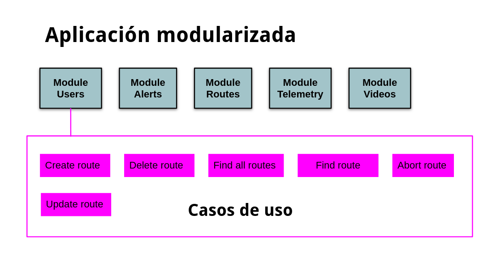

<div>
    <h1 align="center">:snake: Python :snake:</h1>
    <h1 align="center">Drone Guard</h1>
    <h2 align="center">un ejemplo para aprender de</h2>
    <h1 align="center">Clean Code & SOLID & Refactoring & Clean Architecture & Code Smell</h1>
    <h3 align="center">miguel.granadino@gmail.com</h3>
<div>
    

## Table of contents
* [Uso de la aplicación](#uso-de-la-aplicación)
* [Entorno Virtual](#entorno-virtual)
* [Github](#github)
* [PaaS](#paas)
* [Heroku](#heroku)
* [Docker](#docker)
* [Problemas y soluciones](#problemas-y-soluciones)
* [Clean code](#clean-code)
* [SOLID](#solid)
* [Clean architecture](#clean-architecture)
* [Code smell](#code-smell)
* [Writing faster Python](#Writing-faster-python)


## Uso de la aplicación

### Ejecutar la aplicacion
entrypoint.py
```sh
/usr/bin/python3 /home/miguelgranadino/Escritorio/drone_guard/entrypoint.py
```

### Ejecutar los tests
```sh
python -m unittest -v
```

### Covertura de los tests
```sh
coverage run -m unittest && coverage report
```

### Dependencias

requirements.txt --> archivo donde deberiamos meter las dependencias

```sh
sudo pip install coverage
sudo pip install html-testRunner
sudo pip install pyyaml
sudo pip install flask_api
sudo pip install flask_script
sudo pip install flask_testing
sudo pip install flask-sqlalchemy
```
```sh
pip freeze > requirements.txt
pip install -r requirements.txt
pip list
```

### Diseño del sistema


### Arquitectura de la API



## Entorno virtual
pip --> sistema de gestión de paquetes.</br>
Python Package Index (PyPI) --> que es el repositorio de paquetes oficial.</br>
virtualenv --> herramienta para crear entornos virtuales.</br>
venv --> módulo oficial del lenguaje que a partir de la versión 3.3 nos permite crear entornos virtuales</br>
```sh
apt-get install python3-venv
# Crear un entorno virtual con python3
python3 -m venv entorno3
cd entorno3
# Activar el entorno virtual
source entorno3/bin/activate
# Sesactivar el entorno virtual
$ deactivate

# Instalar la última versión de un paquete
(entorno3)$ pip install django
# Instalar una versión especifica de un paquete
(entorno3)$ pip install requests=="2.12"

# Paquetes instalados con sus dependencias
(entorno3)$ pip list
# Borrar un paquete
(entorno3)$ pip uninstall requests

# Crear fichero con todas las dependencias
(entorno3)$ pip freeze > requirements.txt
# Instalar todas las dependencias y asi tener entornos identicos
pip install -r requirements.txt
```

## Github
```sh

# Crear un repositorio
git init .

# Bajarse (clonar) el código de GitHub
git clone https://github.com/Akira3030/drone_guard

# Commit (local)
git add .
git commit -m "comentario"

# Subir cambios al repositorio
git push -u origin master
   Username:
   Password:
git status

# Bajarse los cambios del repositorio
 git pull https://github.com/Akira3030/drone_guard.git master
```

## PaaS
PaaS = platform as a service --> plataforma como servicio
### Heroku
https://www.heroku.com
### Linode
https://www.linode.com/
### DigitalOcean
https://www.digitalocean.com/
### AWS Lightsail
https://aws.amazon.com/es/lightsail/

### PythonAnywhere
https://www.pythonanywhere.com/

## Heroku 
https://www.heroku.com/<br>
<p>PaaS = platform as a service. Soporta varios lenguajes: Ruby, Java, Node.js, Scala, Clojure, Python, PHP y Go.</p>
Crear una cuenta en Heroku <br>
En the Dashboard seleccionar New -> Create new app (se puede hacer con el CLI)<br>

<p>Heroku necesita el fichero Procfile. Que comandos ejecutar para iniciar nuestro sitio web</p>

```
web: gunicorn mysite.wsgi --log-file -
```


### Heroku CLI

CLI = Command Line Interface
```sh
heroku help

heroku login
# Creamos la aplicación
heroku create mi-app --region=eu
# Unir nuestra aplicación con el repositorio git
heroku git:remote -a mi-app
# Crear BBDD
heroku addons:create heroku-postgresql:hobby-dev
# Se creara la variable de entorno --> DATABASE_URL

heroku open
heroku logs --tail
# Elimiar de Heroku nuestra aplicación
heroku destroy -a  --confirm 
# Para crear variables de entorno
heroku config:set CONFIG_VALUE=password
# Ver si se esta ejecutando alguna instancia
heroku ps:scale web=1
# Ver releases
heroku releases
# Abrir la aplicación
heroku open

```

URL Generada --> https://{app-name}.herokuapp.com/</br>
El repositorio remoto --> https://git.heroku.com/{app-name}-api-heroku.git</br>

<p>Cada vez que realizamos el despliegue, pasará todo el proceso de integración continua: Jenkins, Travis, etc</p>

## Docker
Hay dos versiones de Docker:<br>
Free community edition (CE) --> la que usaremos<br>
Enterprise edition (EE)<br>


```sh
 docker version
```
Dockerfile de ejemplo:
 ```sh
# Imagen a utilizar --> name:tag
# python es la imagen docker oficial.  
# tag selecciona el interprete de Python Python 3.6 interpreter instalado en Alpine Linux.
# The Alpine Linux distribution es usada en vez de Ubuntu Ubuntu porque es de pequeño tamaño.
FROM python:3.6-alpine

# Ejecuta un comando en el contenedor
# En este caso de se crea un usuario (microblog) para no tener que trabajar como root.
RUN adduser -D microblog

# Crea el directorio de trabajo
WORKDIR /home/microblog

# Transfiere archivos desde tu maquina al sistema de ficheros del contenedor
COPY requirements.txt requirements.txt
# Crea el entorno virtual
RUN python -m venv venv
# Instala las dependencias de la aplicación
RUN venv/bin/pip install -r requirements.txt
# Instala gunicorn --> el servidor web 
RUN venv/bin/pip install gunicorn

COPY app app
# install the application in the container
COPY migrations migrations
COPY microblog.py config.py boot.sh ./
RUN chmod +x boot.sh

# Crea la variable de entorno FLASK_APP requerida para usar el comando flask
ENV FLASK_APP microblog.py

RUN chown -R microblog:microblog ./
# Hace que el usuario microblog sea el de por defecto
USER microblog

# Confirura el puerto del contenedor que usara el servidor
EXPOSE 5000
# Comando por defecto que se ejecutara cuando el contenedor sea arrancado
ENTRYPOINT ["./boot.sh"]
 ```
 
```sh
#!/bin/sh
source venv/bin/activate
flask db upgrade
flask translate compile
exec gunicorn -b :5000 --access-logfile - --error-logfile - microblog:app
```
 
 ## Gunicorn
 


 ## Problemas y soluciones
 
 ### Problemas
- Evitar el código espagueti
- **Código altamente acoplado**: al framework, a librerias y entre las clases
- Sobre carga de responsabilidades: ejemplo controladores obesos
- Violación del SRP (por lo de arriba)

### Solución
- Rediseño a bajo nivel --> clean code
- Rediseño a alto nivel --> clean arquitecture
- Rediseño de procesos --> integración continua,etc
- Transferencia de conocimiento --> charlas formativas --> Rethinking Code con casos prácticos (dos horas semanales)

### Rediseño a bajo nivel
- Clean code
- Code Smell
- Refactoring
- Principios SOLID
- Tell don't ask

### Rediseño a alto nivel (arquitectura)
- Arquitectura hexagonal

## clean code

### 1) Evitar magic numbers
```python
# Bad:What the heck is 86400 for? --> No hardcode
time.sleep(86400);

# Good:Extract magic number as a variable
SECONDS_IN_A_DAY = 86400
time.sleep(SECONDS_IN_A_DAY)
```

### 2) Los nombres de variables deben revelar intención

```python
# Bad:
df = pd.read_csv('comercios.csv')
# Good:
comercios = pd.read_csv('comercios.csv')

# Bad:
addCmt
# Good:
addComment

# Bad:
user.createUser() --> User es redundante
# Good:
user.create();
```

### 3) La regla del Boy Scout

- Deja el campo más limpio de como te lo encontrastes

### 4) Funciones
- 20 lineas de largo
- Hacer una única cosa
- Command Query Separation --> Las funciones deben hacer algo o devolver algo pero no ambas cosas.
- No más de dos argumentos
- Mejor devolver excepciones que códigos de error siempre.
- No usar Switch --> Los switchs hacen n cosas
- Encapsular condicionales, evitar poner en los if cadenas de booleanos, mejor una subfunción con un nombre explícito
- Evitar condicionales negativas

### 4) Try - except

- Si hay un bloque try/catch mejor simplificarlos extrayendo funciones para cada uno de los bloques.
- Si hay try/catch en una función no debería haber nada más, si no seguro se está haciendo más de una cosa.
```python
try:
    hagoAlgoQuePuedeFallar()
except Exception as error:
    logError(error)
    
def logError(Exception e):
    logfile.exception(error)
```
### 5) Comentarios
- Los comentarios solo están justificados cuando no somos capaces de expresarnos con el código.

### 6) Clases
- Nombres de clases: evitar palabras como Manager, Services, Processor, etc
- El tamaño de los ficheros no debería superar las 200 líneas de media, con un límite máximo en 500.
- La anchura de las líneas de código, entre 80 y 120 caracteres, no deberíamos hacer scroll horizontal para leer código.
- El equipo debería tener unas reglas convenientemente consensuadas.

### 7) Errores
- Crear clases para los casos especiales en lugar de dejar al código cliente procesar el caso excepcional (patrón caso especial, Fowler).
- En general no es recomendable devolver null, en su lugar es mejor devolver una excepción o un objeto de caso especial.
- No usar códigos de error ya que confunden el flujo de ejecución y obligan al invocador a procesarlos inmediatamente.

### 8) Tests
- Un assert por test
- se debe probar todo lo que pueda fallar
- Usar herramientas de cobertura
- No ignorar pruebas triviales, sobre todo por su labor de documentación
- Las pruebas deben ser rápidas (no más de 30 segundos todas)

## SOLID

### 1) Pricipio de inversión de dependencias
Principio de diseño de clases
- Nuestras clases deben depender de abstracciones, nunca de detalles concretos. 
De esta forma podremos tener nuestras entidades desacopladas facilitando su mantenimiento.
- Inyección de dependencias –> Un objeto no es responsable de instanciar sus dependencias, lo delega

```python
#Injeccion de dependencias
command = FindAllDocumentsQuery()
use_case = FindAlldocumentsUseCase(command)
routes = use_case.execute()
```

### 2) Principio de responsabilidad única

 ```python
# Clase obesa o clase dios.
# Esta clase se salta el principio de responsabilidad única, hace muchas cosas

class UserRepository:

    def __init__(self):

    def get_all_users(self):
    
    def get_user(self, user_id):
    
    def delete_user(self, user_id):
    
    def update_user(self, user):
    
    def create_user(self, user):

# Dividimos la clase en varias que hagan una única cosa

class GetAllUserQuery:
    def __init__(self):
        ...
    def execute():
        ...

class GetUserQuery:
    def __init__(self):
        ...
    def execute():
        ...

class DeleteUserCommand:
    def __init__(self):
        ...
    def execute():
        ...

class UpdateUserCommnad:
    def __init__(self):
        ...
    def execute():
        ...

class CreateUserCommand:
    def __init__(self):
        ...
    def execute():
        ...
```


## clean architecture

### 1) Identificadores UUIDs

- Este tipo de identificadores son útiles para evitar delegar la responsabilidad de generación de IDs a nuestra infraestructura. 
- Dado que los UUIDs son generados de forma aleatoria, y con una probabilidad despreciable de colisión, podemos hacer que nuestras entidades tengan el identificador como uno de los parámetros necesarios para ser construidos.
- Con esto hacemos que no sea necesario pasar por el repositorio de base de datos para saber qué identificador tendrá la entidad, con lo que lo podemos esperar incluso desde fuera.

```python
import uuid 

id_user = uuid.uuid1())
```

### 2) Desacoplar del framework
- No estamos obligados a usar la estructura de directorios del framework.
- Desacoplarnos de la estructura de directorios marcada por los frameworks, y cómo podemos llegar a hacerlo.
- ¿Qué beneficios tiene saltarte esto? si sale una nueva versión del framework.
Separar el dominio de la aplicación.
 
 ### 3) Tell don't ask
 <b>No usar getters y setters</b>
 - Añadir un constructor para rellenar los atributos de clase
 - Usar atributos de clase privados y sin setters
 - Evitar exponer la escritura de sus atributos (hacerlos privados, y no tener setters/getters).
 - Si no lo hacemos asi podrian darse estados incosistentes de nuestro monedo de dominio: por ejemplo crear un usuario sin email.
 - Hacer los atributos privados, no accesibles desde fuera.
 - Meter las validaciones de los atributos dentro de las clases. Como metodos privados.
 - El modelo de domino ya no es anemico.
 
 <b>Esconder los detalles de implentación de las clases</b>
 - Si modificamos algun metodo privado de nuestra clase ese cambio no afectara a otras clases.
 - Si hay muchas otras clases que usen metodos de nuestras clases cuando cambiemos esos metodos tambien tendremos que cambiar el resto de clases que la usan (por eso hay que evitar el acoplamiento entre clases).
 
 [TellDontAsk](https://martinfowler.com/bliki/TellDontAsk.html)
 
 
 
 ### 4) Modelo de domios anemicos (anti-patrón de DDD)
 - Solo tienen atributos sin comportamiento
 - Por lo tanto son DTOs (Data Transfer Objectos)
 
 
 ### 4) Testing
 - Diseñar la clase sabiendo que debera ser testeada
 
 ### 5) Excepciones del dominio
 - Una excepción exprese unívocamente un comportamiento inesperado y pueda capturarse de manera única
 - Esto nos va a ayudar con la semántica del código y proporcionar unos errores más semánticos
 - La excepción está hablando nuestro lenguaje de dominio
 
  ```python
 class UserNotFind(Exception):
    pass

if not self.exist_user_in_bd(user_id):
    raise UserNotFind
 ```
 
 ```python
 class CityNotAllowedException(Exception):
     message = 'The city {city} is not allowed'
    		
     def __init__(self, city: str) -> None:
         self.city = city
    	 super().__init__(self.message.format(city=city))
    

    	
  if user.city not in allowed_cities:
      raise CityNotAllowedException(user.city)
 
  ```
 
 
 ### 6) Clausulas de guarda

Una clausula de guarda es una pieza de código que normalmente está al comienzo del método y comprueba una serie de condiciones para continuar con la ejecución o cortarla. Es muy usada cuando **programamos sin usar else** (lo cual es una muy buena práctica para mantener un código limpio y entendible), cuando no queremos tener muchos niveles de identación del código y para ayudar a mejorar la legibilidad y semántica del código.

 
 ```python
 # Código farragoso de leer con multiples niveles de if-else
 if self.user_is_ready(user_id):
     if self.is_the_right_moment_to_notify_this_user():
         if.self ...
             return ...
         else:
             return ...
       else:
          ...
 else:
    ...
    
 # Refactoring con clausulas de guarda --> mucho más facil de leer
 if len(user_id) < 1:
     raise UserIdFormatError
     
 if not self.user_is_ready(user_id):
     raise UserIsNotReady
     
 if not is_the_right_moment_to_notify_this_user():
     raise UserIsNotRightMomentToNotify
  
  ...
 
 ```
 
 ### 7) Composición sobre herencia
 
 - Mejor componer las clases a heredar de otras clases
 - ¿Y si tienes código común?¿heredar?
 - Evitar tener una clase por ejemplo BaseController, BaseManager, UserManager, UserRepository, etc
 
 ```python
 #Composición --> injeccion de dependencias
command = FindAllDocumentsQuery()
use_case = FindAlldocumentsUseCase(command)
routes = use_case.execute()
 ```

 
## code smell
- Código dificil de entender
- Código dificil de modificar
- 

## Writing faster Python

### Ordenar una lista

 ```python
sorted(MILLION_RANDOM_NUMBERS) # 467ms
MILLION_RANDOM_NUMBERS.sort() # 77.6 ms (6 veces más rapido)
 ```
 
### Validar si una lista esta vacia

 ```python
if len(mi_lista) == 0 # 91.7ns

if mi_lista == [] # 56.3 ns

if not a mi_lista # 32.4ns
 ```
 
 ### List() o []
 
 ```python
List() # 104 ns
  
[] # 22.5 ns
```

### Contar numero de elementos en una lista

```python
count = 0
for element in MILLION_RANDOM_NUMBERS:
    count += 1
print count

print len(MILLION_RANDOM_NUMBERS) # 96 ns (274000 veces más rapido)
 ```
 
 ### Filtrar una lista
 
 ```python
 output = []
 for element in MILLON_NUMBERS:
     if element % 2:
         output.append(element)  # 222 ns
 
 [item for item in MILLON_NUMBERS if item % 2] # 127 ms
 ```
 
 ### Borrar elementos de una lista
 
 ```python

unique = []
for element in MILLON_NUMBERS:
     if element not in unique:
         unique.append(element)  # 8.29 s
         
set(MILLON_NUMBERS) # 19,3 ms (400 veces más rapido)
```

### Validar true

 ```python
 if variable == True: # 35.8 ns
 
 if variable is True: # 28.7 ns
 
 if variable # 20.6 ns (75% más rapido)
```


 
 
 
 
 
 

